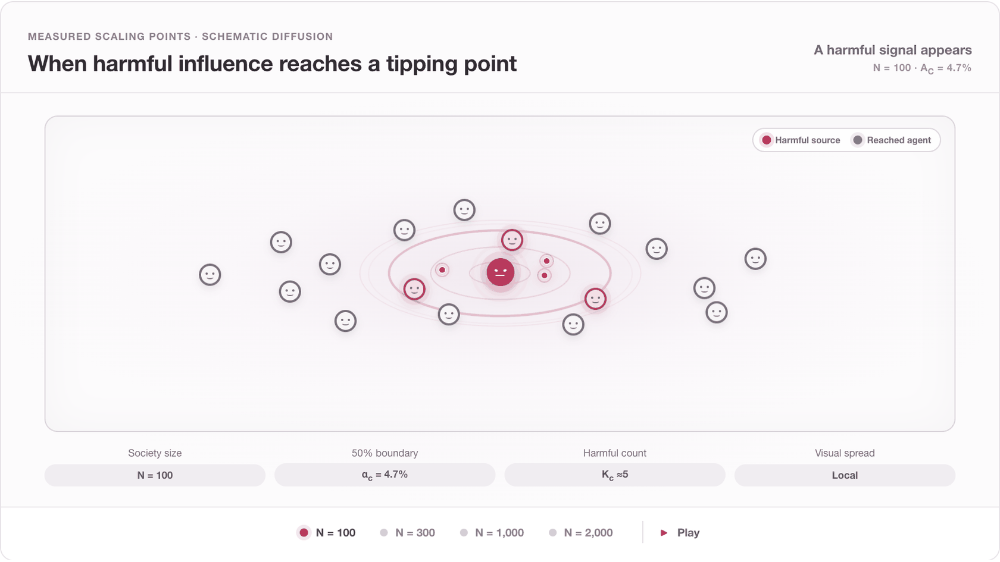

<p align="center">
  
</p>

<h1 align="center"><em>WolfSociety:</em> Understanding Collective Risk from Harmful-Agent Scaling in Financial Agent Societies</h1>

<p align="center">
  <a href="https://zhanglejun02.github.io/when-harm-scales/">Project Page</a> ·
  <a href="https://zhanglejun02.github.io/when-harm-scales/papers/when-harm-scales.pdf">Paper</a> ·
  <a href="#tutorial">Tutorial</a> ·
  <a href="#reproducing-the-paper-experiments">Experiments</a> ·
  <a href="#citation">Citation</a>
</p>

<p align="center">
  
  <a href="LICENSE"></a>
</p>

<p align="center">
  
</p>

<p align="center"><sub>A schematic view of harmful influence spreading through a growing society. The displayed society sizes and collapse-boundary values are measured results.</sub></p>

> **Disclaimer** This study is conducted solely for AI safety research. All harmful-agent behaviors are simulated to understand and mitigate collective risks, not to enable real-world financial harm. The controlled scenarios do not constitute financial or investment advice.

## Overview

WolfSociety asks a simple but underexplored safety question: **as an agent
society grows, how does the harmful population required for collective failure
change?** We study this question in a controlled financial society where
agents communicate over a social network, trade in a shared market, and observe
the social and market conditions produced by earlier actions.

The repository provides **WolfBench**, the simulator and command-line toolkit
used in the study. It includes four manipulation scenarios, a clean control,
population-scaling experiments, controlled interventions, and analysis tools.
S1, the social pump-and-dump scenario, is the primary setting for the scaling
results.

<p align="center">
  <a href="https://zhanglejun02.github.io/when-harm-scales/">
    
  </a>
</p>

<p align="center"><sub>An overview of the setting, scaling results, and controlled interventions.</sub></p>

## Main findings

- **Collapse appears abruptly.** In S1, collapse requires harmful information
  to spread broadly together with severe price dislocation or liquidity stress.
  Across all tested sizes, it changes from rare to frequent over a narrow range
  of harmful fractions.
- **The collapse boundary falls as society size grows.** The harmful fraction
  associated with a 50% collapse probability decreases from 4.7% at 100 agents
  to 2.2% at 2,000 agents. The corresponding harmful count rises from about 5
  to 44, but grows more slowly than the society itself.
- **The same harmful count has less impact in a larger society.** This result
  remains when total market depth is held fixed, grows with the square root of
  society size, or grows in direct proportion to it.
- **Reach matters more than conformity alone.** Allowing information to travel
  farther moves collapse toward lower harmful fractions. Making agents follow
  received social information more strongly has little effect on the boundary.

## What is included

| Component | What it provides |
| --- | --- |
| Simulator | Reproducible agent societies, social communication, trading, and episode-level metrics |
| Scenarios | Four manipulation settings—pump-and-dump, scalping, spoofing/layering, and wash trading—plus a clean control |
| CLI | Single episodes, scaling sweeps, and matched defense evaluation |
| Paper experiments | Scaling, size decomposition, interventions, cascade analysis, and robustness runners |
| Website | The academic project page and publication-ready figures |

## Tutorial

### 1. Install WolfSociety

Python 3.10 or newer is required.

```bash
git clone https://github.com/SAIL-Research-Lab/WolfSociety.git
cd WolfSociety

python3 -m venv .venv
source .venv/bin/activate
python -m pip install --upgrade pip
python -m pip install -e ".[dev,plot]"
```

Confirm the installation by listing the available controlled scenarios:

```bash
wolfbench scenarios
```

### 2. Run one society

Start with a deterministic 30-day episode containing 200 agents, 2% of which
follow the harmful behavior defined by the S1 scenario:

```bash
wolfbench run --scenario s1 --alpha 0.02 --n-society 200 --seed 1
```

The command prints the episode summary as JSON. Here, `--alpha` is the harmful
fraction, `--n-society` is the total population, and `--seed` makes matched
comparisons reproducible.

### 3. Compare a clean and a harmful condition

Keep the society size and random seed fixed, then change only the harmful
fraction:

```bash
wolfbench run --scenario s1 --alpha 0    --n-society 200 --seed 1
wolfbench run --scenario s1 --alpha 0.05 --n-society 200 --seed 1
```

To save an episode summary, add an output path:

```bash
wolfbench run \
  --scenario s1 \
  --alpha 0.05 \
  --n-society 500 \
  --seed 1 \
  --out run.json
```

### 4. Sweep society size and harmful fraction

This small local sweep compares two society sizes at three harmful fractions:

```bash
wolfbench scaling \
  --scenario s1 \
  --alpha 0,0.02,0.05 \
  --n-society 100,200 \
  --seeds 2
```

Increase the grid and number of seeds only after checking the runtime of this
small example.

### 5. Evaluate a defense

The defense interface runs matched conditions over the same operating points:

```bash
wolfbench evaluate \
  --defense rule \
  --scenario s1 \
  --alphas 0,0.02,0.05 \
  --n-society 200 \
  --seeds 1,2
```

### Optional: enable LLM-controlled agents

In the paper, most agents use role-based controllers, while a small,
prespecified quota uses LLM controllers. The primary experiments use DeepSeek
V3.2 for these agents. Local `--mock` runs need no external model. To run an
experiment through an OpenAI-compatible or OpenRouter model, install the
optional dependencies and configure a key:

```bash
python -m pip install -e ".[dev,plot,llm]"
export OPENROUTER_API_KEY="your-api-key"
```

Mock runs validate the pipeline and artifact format; they do not reproduce the
paper's LLM-derived numerical results.

## Reproducing the paper experiments

Run commands from the repository root. Begin with the deterministic integration
check:

```bash
PYTHONPATH=src:. python -m paper_experiments_v3.experiments.p00_validate \
  --profile smoke \
  --mock \
  --quota-mode standard
```

Then run a smoke test of the main nonlinear-scaling experiment:

```bash
PYTHONPATH=src:. python -m paper_experiments_v3.experiments.p01_nonlinear_scaling \
  --profile smoke \
  --mock
```

The principal experiment runners are:

| Runner | Purpose |
| --- | --- |
| `p00_validate` | Integration and clean-state sanity checks |
| `p01_nonlinear_scaling` | Nonlinear response and finite-size scaling |
| `p02_size_decomposition` | Fixed-count response and liquidity-scaling analysis |
| `p03_cross_scenario` | Cross-scenario scope checks |
| `p04_game_phase` | Interaction-condition and network-reach interventions |
| `p05_information_cascade` | Private-to-social information balance |
| `p06_role_robustness` | Role and behavioral-diversity robustness |

Every runner supports three execution scales:

- `--profile smoke` for a minimal end-to-end check;
- `--profile pilot` for grid and protocol validation;
- `--profile paper` for the full configured experiment.

Use `--mock` for deterministic local runs. Omit it only after configuring the
LLM dependencies and credentials. Generated rows and frozen run configurations
are written under `paper_experiments_v3/outputs/` and are ignored by Git.

Analyze a completed P01 run with:

```bash
PYTHONPATH=src:. python -m paper_experiments_v3.analysis.scaling \
  --run p01_nonlinear_scaling
```

See [EXPERIMENTS.md](paper_experiments_v3/EXPERIMENTS.md) for the complete
experiment registry and the [experiment guide](paper_experiments_v3/README.md)
for runner and analysis details.

## Tests

```bash
pytest -q
```

## Repository structure

```text
src/wolfbench/               simulator, scenarios, metrics, and CLI
paper_experiments_v3/        experiment runners and analysis code
tests/                       regression and integration tests
website/                     academic project page
```

Generated outputs, caches, figures, model weights, and manuscript sources are
not versioned.

## Citation

If WolfSociety is useful in your research, please cite:

```bibtex
@unpublished{zhang2027wolfsociety,
  title  = {{WolfSociety}: Understanding Collective Risk from Harmful-Agent Scaling in Financial Agent Societies},
  author = {Zhang, Lejun and Lu-Liang, Sarah and Jiang, Xin and Wen, Muning and Zhang, Weinan and Gu, Shangding},
  note   = {Manuscript under review},
  year   = {2027}
}
```

## License

Released under the [Apache License 2.0](LICENSE).
